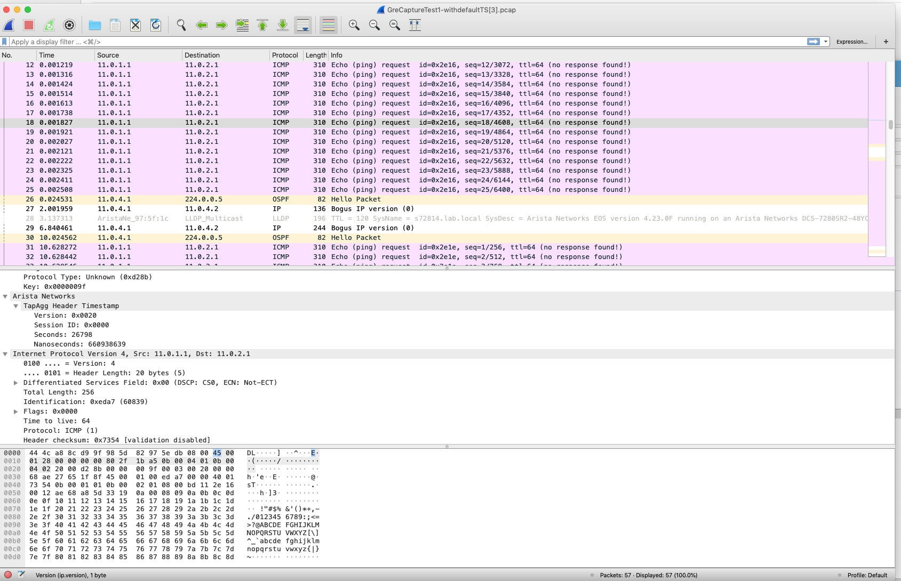

Based on https://eos.arista.com/analyzing-packet-header-timestamps-in-wireshark/
and https://eos.arista.com/eos-4-21-3f/mirroring-to-gre-timestamping/

It will decode following 2 types of packets following Arista TapAgg Header:
1) L3 IP
2) L2 header

**How to install on MAC OSX:**
1) Copy to /Applications/Wireshark.app/Contents/PlugIns/wireshark
2) Analyze -> Reload Lua Plugins in Wireshark

