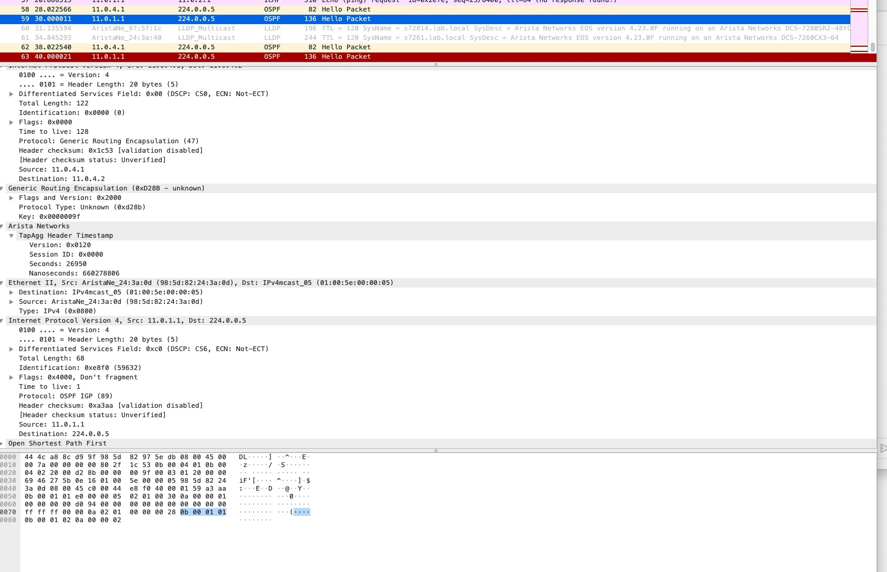

Based on:

- https://eos.arista.com/analyzing-packet-header-timestamps-in-wireshark/
- https://eos.arista.com/eos-4-21-3f/mirroring-to-gre-timestamping/
- https://www.arista.com/en/support/toi/eos-4-26-2f/14837-tap-aggregation-packet-timestamp

gre-mirror-arista.lua will decode following 2 types of packets following Arista TapAgg Header:
1) L3 IP
2) L2 header

tapagg-arista.lua will decode the newer 64b UTC timestamps supported by the 7280R3 platform.

Note: Both of the above cannot be used simultaniously at present.

**How to install on MAC OSX:**
1) Copy to /Applications/Wireshark.app/Contents/PlugIns/wireshark
2) Analyze -> Reload Lua Plugins in Wireshark

**L3 IP after Arista TapAgg Header**

**L2 packet after Arista TapAgg Header**
